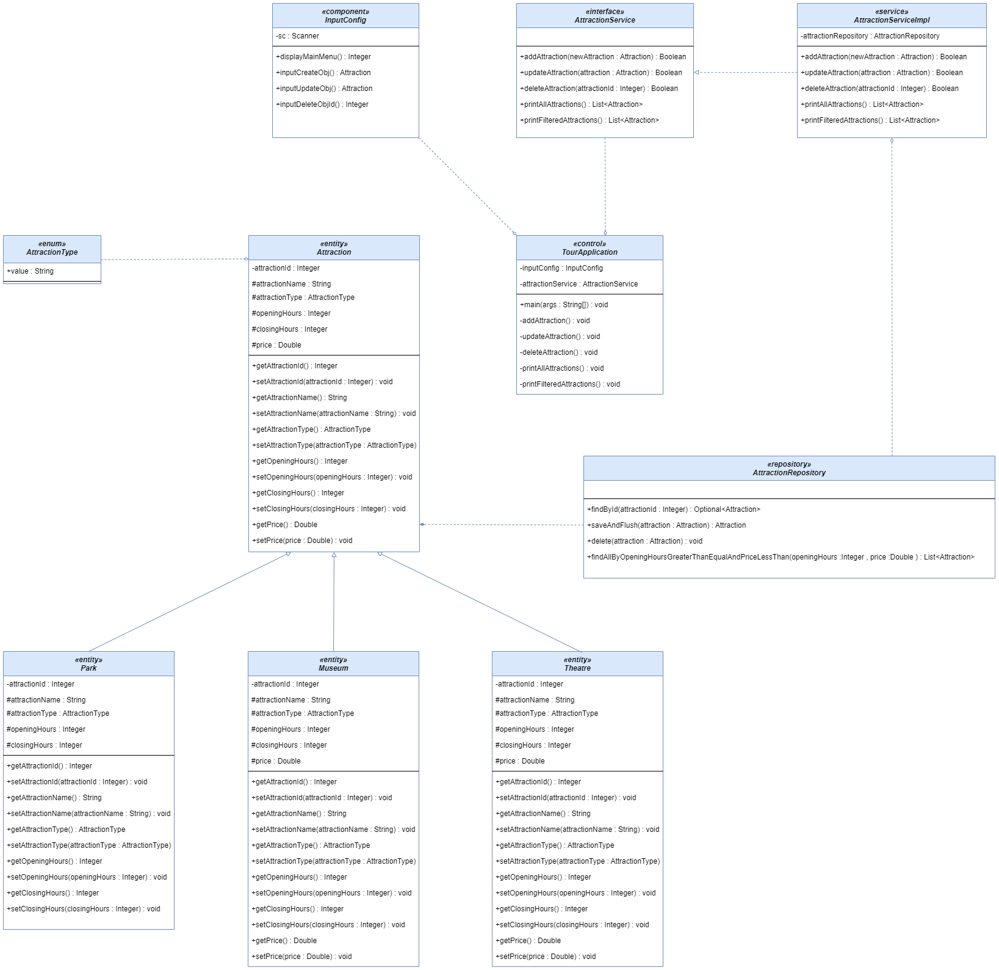

# london_tour_service
Advanced Software Designs

## Technologies
- Apache Maven 3.8.6
- Spring Boot 2.7.6
- Java 11
- Postgres 14

## Solution


## Features
- Add an attraction
- Get all attractions
- Update an attraction
- Delete an attraction
- Get all attractions which open after 1900 and which cost less than £5

## Assumptions
- There are only 3 types of Attractions; Park, Museum, Theatre

## Configuration

> Create a database in Postgres and please configure [_application.properties_](src/main/resources/application.properties) with your `Host, DB name, Username, Password` details.

## Build the project

Please run below command in project root:

```sh
mvn clean install
```

## Run the project

Please run below commands in project root:

```sh
cd target
java -jar tour-0.0.1-SNAPSHOT.jar
```

----------
